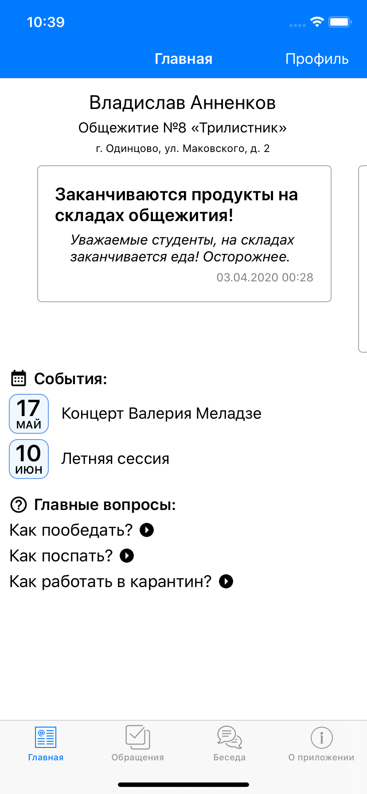
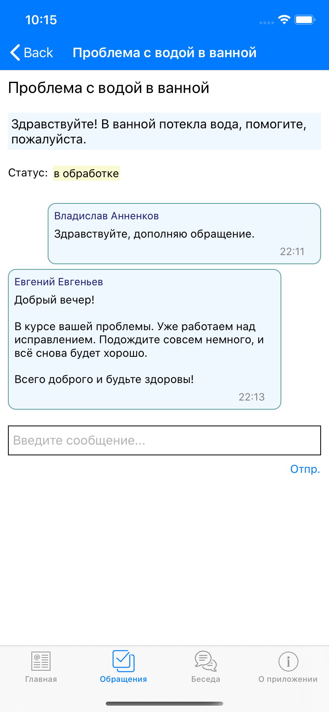
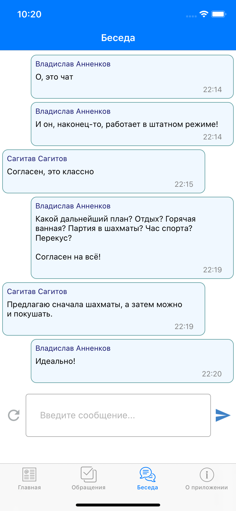

# HSESupporter
**HSESupporter** — приложение для технической поддержки студентов общежитий [Высшей Школы Экономики](https://www.hse.ru/).

Главная страница            |  Обращение          |  Общий чат
:-------------------------:|:-------------------------:|:-------------------------:
  |   |  

Приложение поддерживает iOS 9 и выше.

Функционал:

  * **Главная страница**: Какое-то описание...

  * **Обращения**: Какое-то описание...

  * **Беседа**: Какое-то описание...

  * **О приложении**: Какое-то описание...

## Связанные репозитории
- [Сервер](https://github.com/Vakosta/HSESupporterBackend) на Python;
- [Документация](https://github.com/Vakosta/HSESupporter-Documentation) на LaTeX.

## Контакты
Со мной можно связаться в Telegram: [@vakosta](https://t.me/vakosta).

Или в VK: [/vakosta](https://vk.com/vakosta).

Или E-mail: [v.akosta@ya.ru](mailto:v.akosta@ya.ru).
