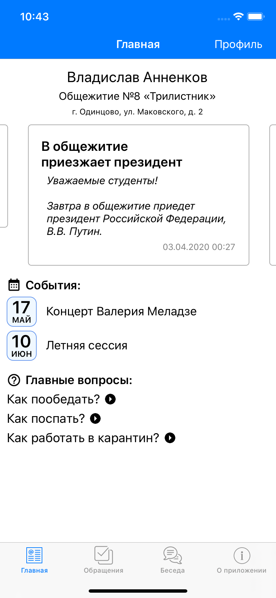

# HSESupporter
**HSESupporter** — приложение для технической поддержки студентов общежитий [Высшей Школы Экономики](https://www.hse.ru/).

Главная страница            |  Обращение          |  Общий чат
:-------------------------:|:-------------------------:|:-------------------------:
  |   |  

Приложение поддерживает iOS 8 и выше.

## Связанные репозитории
- [Сервер](https://github.com/Vakosta/HSESupporterBackend) на Python;
- [Документация](https://github.com/Vakosta/HSESupporterDocumentation) на LaTeX.
